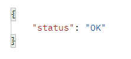
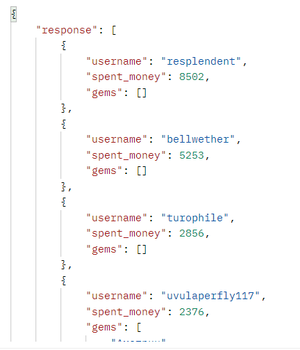

<h1>ТЕСТОВОЕ ЗАДАНИЕ на позицию 
Junior Python разработчик 
</h1>
<br>

В задании описан сервис обработки статистических данных, представленных в виде табличных данных в файле формата csv.
Импорт данных должен производится POST запросом с прикрепленным csv файлом.
Ответ должен быть предоставлен GET-методом, содержащий информацию отвечающую заданным критериям.

<br>

## 🛠️ Для установки запуска сервиса, нужно выполнить следующие действия:

- склонировать текущий репозиторий в локальную папку и выполнить команду:
 ```cmd
    git clone https://github.com/lirik1982/JuniorTest.git
```
- перейдите в папку импортированного репозитория и наберите в командной строке (в системе должна быть установлена программная платформа Docker):
```cmd
    docker-compose up
```
- будет выполнено развертывание docker-контейнеров с настроенными образами:
    - django/drf
    - postgresql
    - redis
 - сервис готов к обработке запросов


## Обработка запросов:
<POST>
Для отправки данных для обработки необходимо выполнить POST-запрос с прикрепленным csv-файлом на адрес:
```cmd
    http://localhost:8000/api/V1/deals
```
Выполнить операцию, например, можно с помощью программы curl, выполнив команду:
 ```cmd
    curl --location --request POST http://localhost:8000/api/V1/deals -F "file=@deals.csv"
```
При успешном выполнении будет получен ответ "response: OK"

Данные внесены в БД, можно выполнять GET-запрос

<GET>
Для получения обработанных данных необходимо выполнить GET-запрос на адрес:
```cmd
    http://localhost:8000/api/V1/deals
```
Выполнить операцию, например, можно с помощью программы curl, выполнив команду:
 ```cmd
    curl --location --request GET http://localhost:8000/api/V1/deals
```
Если действия верные будет получено поле response:

  
